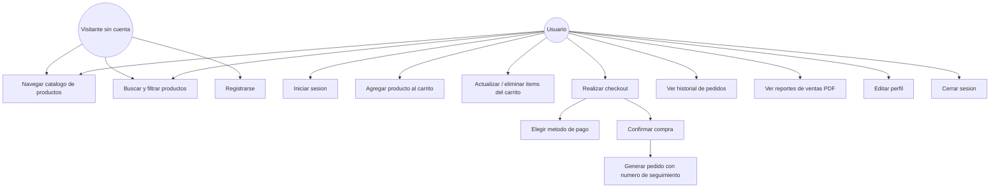

# Diagrama de caso de uso — Proceso de compra

## Flujo textual del proceso de compra

1. El usuario navega el catalogo de productos (con opcion de buscar y filtrar
   por categoria o precio).
2. El usuario debe haber iniciado sesion para agregar productos al carrito.
3. El usuario agrega uno o mas productos al carrito, indicando cantidad.
4. El usuario puede modificar cantidades o eliminar productos del carrito antes
   de pagar.
5. El usuario entra a la pantalla de checkout, donde ve el resumen (subtotal,
   impuestos 13%, costo de envio, total) y elige un metodo de pago (Tarjeta de
   credito o PayPal).
6. Al confirmar, el sistema:
   - Crea un registro en `pedidos` con fecha, montos, metodo de pago y un
     numero de seguimiento unico (`TT-XXXXXXXX`).
   - Crea un registro en `detalle_pedidos` por cada producto comprado.
   - Vacia el carrito de la sesion.
7. El usuario ve la confirmacion del pedido y puede consultarlo despues en
   "Mis pedidos".
